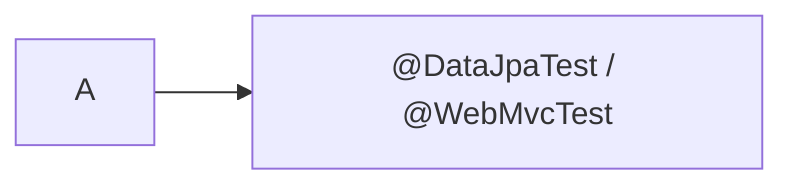

# Obsidian Learning Vault Quality Audit

> [!summary]
> Репозиторий уже является сильной обучающей системой по Spring и Java Concurrency, но пока неравномерен как полный Java Backend vault. Наиболее зрелая часть — Spring Core → AOP/Cache → Transactions → Data/JPA → Testing. Основные риски: неоднородный стандарт карточек, ранее невалидные Mermaid labels, отсутствовавшие foundational notes и пока скелетные маршруты Databases, Messaging и Distributed Systems.

> [!success] Normalization update — 2026-07-21
> `AOP-B01` и `CACHE-B01` нормализованы: 44/44 карточки имеют Question, Russian Translation, Answer, Explanation и Exam Trap. Подробности: [[99_AUDITS/AOP and Cache Card Normalization]].

# 1. Scope

Проверены:

- все Markdown notes;
- все JSON Canvas files;
- все inline Mermaid blocks;
- Obsidian wikilinks;
- certification batch counts и card IDs;
- обязательные card sections;
- source indexes и version boundaries;
- concept depth, examples и diagrams;
- production cases;
- lab README и run instructions;
- навигация между MOC, roadmap, cards, cases и labs.

Автоматическая проверка реализована в:

```text
.github/scripts/audit_vault_v2.py
.github/workflows/vault-quality-audit.yml
```

CI извлекает каждый Mermaid block и передаёт его реальному `mermaid-cli`, а не ограничивается поиском code fences.

# 2. Executive verdict

| Area | Оценка | Заключение |
|---|---:|---|
| Spring concept depth | 4.6 / 5 | Глубокие mechanism-oriented notes, production transfer, version policy |
| Spring technical precision | 4.5 / 5 | Хорошее разделение Spring 5.3/Boot 2.7 и current docs; есть точечные semantic wording fixes |
| Spring cards | 2.8 / 5 | Количество и coverage высокие, но многие cards не соблюдают собственный mandatory-section standard |
| Java Concurrency | 3.9 / 5 | Хороший foundation с examples/labs; audit добавил недостающие Threads, Future и ForkJoinPool |
| Java language, collections, JVM | 1.8 / 5 | В Java Map в основном headings; canonical vertical slices ещё не построены |
| Databases | 1.2 / 5 | Пока outline без связанных concepts, cases, cards и labs |
| Messaging | 1.2 / 5 | Пока outline; нет Kafka/RabbitMQ executable routes |
| Distributed Systems | 1.2 / 5 | Пока outline; reliability patterns перечислены, но не раскрыты |
| Canvas structural integrity | 5 / 5 | Все Canvas JSON валидны; broken node references, isolated nodes и крупные overlaps не обнаружены |
| Mermaid integrity до repair | 4.1 / 5 | 76 из 86 diagrams проходили renderer; 10 имели syntax defects в labels |
| Navigation integrity до repair | 4.2 / 5 | Найдено 15 broken wikilinks; часть отражала реальные отсутствующие foundational notes |

# 3. Сильные стороны

## 3.1 Spring построен как end-to-end learning route

Маршрут не ограничен определениями:

```text
canonical concept
    ↓
active-recall cards
    ↓
production incidents
    ↓
executable lab
    ↓
review dashboard
```

Это обеспечивает четыре уровня обучения:

1. recall;
2. discrimination;
3. mechanism explanation;
4. transfer to production diagnosis.

## 3.2 Версионная точность

Source indexes фиксируют executable baseline:

```text
Java 8
Spring Framework 5.3.39
Spring Boot 2.7.18
Spring Data JPA 2.7.18
Hibernate 5.6.15.Final
javax.persistence
```

Современная документация используется только для stable concepts или явно помеченных newer capabilities. Это существенно снижает риск смешения:

```text
Spring 5 / javax
Spring 6 / jakarta
Spring Data 2.7
Spring Data 3+
```

## 3.3 Production cases имеют инженерную ценность

Сильные vertical slices рассматривают:

- observable symptom;
- code or configuration;
- execution timeline;
- root cause;
- proof/diagnostics;
- repair;
- prevention.

Особенно зрелые области:

- proxy/self-invocation;
- transaction propagation;
- cache consistency;
- persistence context;
- flush/commit;
- N+1;
- transactional tests;
- Testcontainers boundaries.

## 3.4 Labs проверяют mechanism, а не только API syntax

Примеры:

- `REQUIRED` и `UnexpectedRollbackException`;
- `REQUIRES_NEW` independent commit;
- dirty checking без `save()`;
- detach/merge;
- N+1 statement counts;
- Caffeine/Redis differences;
- test-managed transaction против service transaction;
- H2 против PostgreSQL Testcontainers.

# 4. Найденные structural defects

## 4.1 Mermaid syntax

Baseline audit:

```text
Total Mermaid blocks: 86
Rendered:              76
Failed:                10
```

Root cause — unquoted labels, содержащие:

- `@PostConstruct`;
- `@Configuration`;
- `@Bean`;
- `@Profile`;
- `@DataJpaTest`;
- `/` и длинные annotation expressions.

Плохой fragment:

```text
flowchart LR
    A --> B[@DataJpaTest / @WebMvcTest]
```

Исправленный fragment:



Deterministic repair применён к восьми Markdown files. CI обязан продолжать блокировать merge, если хотя бы один diagram не рендерится.

## 4.2 Broken wikilinks

Baseline audit нашёл 15 missing targets. Причины:

1. concept существовал под другим canonical name;
2. foundational note действительно отсутствовала;
3. comparison note была заявлена системой, но не создана.

Добавлены canonical notes:

- [[10_CONCEPTS/Java/Concurrency/Threads]];
- [[10_CONCEPTS/Java/Concurrency/Future]];
- [[10_CONCEPTS/Java/Concurrency/ForkJoinPool]];
- [[10_CONCEPTS/Java/JVM/Memory Leaks]];
- [[10_CONCEPTS/Spring/Core/Bean vs Component]];
- [[10_CONCEPTS/Spring/Core/Qualifier vs Primary]];
- [[10_CONCEPTS/Spring/Core/BeanPostProcessor vs BeanFactoryPostProcessor]].

Existing concepts с alternative labels должны ссылаться на canonical full path, а не создавать ещё одну почти одинаковую note.

## 4.3 Duplicate source indexes

Два почти одинаковых AOP/Cache source indexes создавали риск расхождения. Каноническим выбран version-pinned:

- [[98_SOURCES/Spring AOP and Cache Sources]].

Старый файл преобразован в compatibility redirect.

# 5. Diagram review

## 5.1 Canvas

Проверены:

- JSON parsing;
- unique node IDs;
- unique edge IDs;
- `fromNode`/`toNode` existence;
- file-node paths;
- positive geometry;
- disconnected ordinary nodes;
- существенные overlaps.

Результат:

```text
Canvas files:                 13
Invalid JSON:                  0
Missing node references:       0
Missing file-node targets:     0
Disconnected ordinary nodes:   0
Substantial overlap pairs:     0
```

Canvas в текущем vault — primarily navigation maps. Это правильно, но небольшие maps следует оценивать как route navigation, а не как доказательство mechanism depth.

## 5.2 Semantic diagram precision

Исправлены или отмечены:

### `@DataJpaTest`

Нельзя утверждать безусловно, что annotation всегда означает embedded database.

Точнее:

```text
transactional rollback by default
+
embedded replacement only when Boot replacement applies
```

### LongAdder

Diagram `Thread → Cell` является illustration striped updates, а не permanent ownership mapping. Thread не закреплён навсегда за одной cell.

### Bean lifecycle

Lifecycle diagram должен явно отделять stable public phases от version-sensitive internal processor order.

### Transaction diagrams

Не смешивать:

```text
logical transaction scope
physical database transaction
savepoint
independent transaction
```

# 6. Card-system quality

Vault standard требует:

```text
Question
Russian Translation
Answer
Explanation
Exam Trap
```

Для сложных тем также:

```text
Mini Example
Memory Hook
Production Transfer
```

Baseline audit выявил batches, где card_count правильный, но mandatory sections представлены не во всех cards.

| Batch | Cards с missing mandatory sections |
|---|---:|
| CORE-B01 | 2 / 20 |
| CORE-B02 | 0 / 24 |
| CORE-B03 | 0 / 24 |
| CORE-B04 | 2 / 24 |
| CORE-B05 | 0 / 24 |
| CORE-B06 | 0 / 24 |
| AOP-B01 | 0 / 24 — normalized |
| CACHE-B01 | 0 / 20 — normalized |
| TX-B01 | 28 / 32 |
| DATA-B01 | 34 / 36 |
| TEST-B01 | 34 / 36 |

После нормализации AOP/CACHE остаются 98 cards с missing mandatory sections. Это не означает, что они технически неверны; они ещё не соответствуют собственному pedagogical contract.

## Required normalization strategy

Не добавлять boilerplate механически. Для каждой incomplete card:

1. `Explanation` должна раскрывать mechanism;
2. `Exam Trap` должна описывать конкретную ошибку выбора;
3. `Mini Example` добавляется только когда distinction зависит от code/path;
4. `Production Transfer` связывает правило с incident;
5. повторяющийся textbook content остаётся в canonical note.

Приоритет нормализации:

```text
TX-B01
DATA-B01
TEST-B01
CORE-B01 / CORE-B04
```

# 7. Coverage by domain

## 7.1 Spring — mature

Существуют:

- concepts;
- cards;
- Canvas;
- production cases;
- labs;
- source indexes;
- roadmap;
- review drills.

Основной долг — card normalization и runtime execution CI для Maven/Testcontainers labs.

## 7.2 Java Concurrency — solid foundation

Сильные темы:

- JMM;
- happens-before;
- volatile/synchronized;
- locks;
- executors;
- CompletableFuture;
- virtual threads;
- CAS;
- deadlocks;
- concurrent collections;
- backpressure.

После audit добавлены отсутствовавшие foundations:

- threads;
- Future;
- ForkJoinPool;
- memory leaks.

Оставшийся долг:

- parallel-stream deep dive;
- structured concurrency/version boundary;
- thread dump/JFR practice lab;
- dedicated JVM route.

## 7.3 Java language, collections и JVM — skeletal

Сейчас эти области в основном присутствуют как bullet lists в Java Map.

Нужны vertical slices:

```text
Language-B01
Collections-B01
Streams-B01
JVM-B01
Java Evolution-B01
```

## 7.4 Databases — outline only

Map перечисляет правильные темы, но пока отсутствуют:

- canonical notes;
- SQL examples;
- execution plans;
- PostgreSQL labs;
- lock/MVCC experiments;
- cards;
- production cases.

Рекомендуемый первый route:

```text
DB-B01 — Indexes and Query Plans
DB-B02 — Transactions, MVCC and Locks
DB-B03 — Partitioning, Replication and Sharding
```

## 7.5 Messaging — outline only

Нужны:

```text
MSG-B01 — Delivery Semantics and Idempotency
KAFKA-B01 — Partitions, Consumer Groups and Rebalancing
RABBIT-B01 — Exchanges, Ack, Prefetch and DLX
OUTBOX-B02 — Relay, CDC and Ordering
```

## 7.6 Distributed Systems — outline only

Нужны mechanism-first routes:

```text
REL-B01 — Timeout, Retry, Circuit Breaker and Bulkhead
CONS-B01 — CAP, consistency and consensus boundaries
SAGA-B01 — Saga and compensation
OBS-B01 — logs, metrics, traces, SLI/SLO
```

# 8. Priority backlog

## P0 — merge blockers

- [x] Добавить repository-wide static auditor.
- [x] Добавить real Mermaid renderer в GitHub Actions.
- [x] Найти 10 broken Mermaid blocks.
- [x] Применить deterministic quoting repairs.
- [x] Добавить отсутствовавшие foundational link targets.
- [x] Получить green final audit after all repairs.

## P1 — pedagogical correctness

- [x] Нормализовать mandatory sections в AOP-B01 и CACHE-B01.
- [ ] Нормализовать mandatory sections в TX/DATA/TEST cards.
- [ ] Добавить source-index links в notes, где их нет.
- [ ] Зафиксировать uniform H2 card heading style.
- [ ] Добавить manual technical review checklist для diagrams.
- [ ] Запустить Maven/Testcontainers labs в CI или dedicated environment.

## P2 — breadth

- [ ] Java language/collections/JVM vertical slices.
- [ ] Database routes.
- [ ] Messaging routes.
- [ ] Distributed systems routes.
- [ ] Interview drills across new domains.

# 9. Definition of done для новой темы

Новый route нельзя считать published только по числу строк или cards.

Минимальный quality gate:

```text
canonical note
mechanism diagram
real code/SQL example
contrast table
production failure
active-recall cards
source index
executable or reproducible lab
Canvas route
green link/Canvas/Mermaid audit
```

Для database/messaging темы lab может быть Docker/Testcontainers-based. Для pure Java темы — `javac`/JUnit project.

# 10. Final assessment

Текущий vault уже значительно сильнее обычного набора заметок:

- есть единая architecture;
- theory связана с recall и production transfer;
- Spring route глубокий и практически полезный;
- diagrams используются по назначению;
- source policies снижают version confusion.

Но утверждение «полная Java Backend knowledge base» пока преждевременно. Более точное состояние:

> **Mature Spring learning system + solid Java Concurrency foundation + skeletal maps for remaining backend domains.**

Главный следующий quality step — не добавлять ещё больше Spring content, а:

1. довести CI audit до green;
2. нормализовать card quality;
3. построить Database и Messaging vertical slices;
4. выполнить labs в real runtime;
5. сохранять один canonical source of truth для каждой темы.
